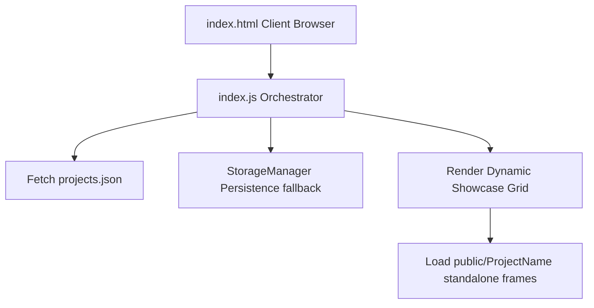

# 🛠️ 100 Days · 100 Web Projects Developer Onboarding & Architecture Guide

Welcome to the contributor development community! This comprehensive document is designed to walk you through the architectural components of this repository, our standards, how to setup and troubleshoot your local environment, and how to make professional contributions.

---

## 🧭 Directory Map

```
100_days_100_web_project/
├── index.html              # Core showcase website entry
├── index.js               # Frontend showcase orchestration, searching, & filtering
├── style.css              # Glassmorphic cybernetic CSS tokens and theme engine
├── projects.json          # Main database indexing all projects
├── public/                # Standalone standalone projects
│   ├── ProjectName/
│   │   ├── index.html
│   │   ├── style.css
│   │   ├── script.js
│   │   └── README.md
├── .github/workflows/     # CI pipelines (PR validator, linter, auto-assigner)
└── docs/                  # Architectural manuals and guides
```

---

## 🏛️ System Architecture Overview

The application is structured as a **statically rendered micro-frontend showcase portal**.



### Key Modules:
1. **Showcase Orchestrator (`index.js`)**: Resolves project listings, runs fast category chips filtering, and applies the custom Quadratic Ease-In-Out scroll mechanics.
2. **StorageManager (`index.js`)**: An isolated safety-wrapper around standard `localStorage` APIs that handles incognito mode state persistence, third-party block exceptions, and `QuotaExceededError` occurrences dynamically with in-memory array fallbacks.
3. **Hero Terminal Canvas (`hero-terminal.js`)**: An optimized custom WebGL renderer powered by `OGL` that executes a real-time retro shader grid with curvature effects, chromatic aberration simulation, and cursor ripple physics. Reduces DPR on touch devices for fluid performance.

---

## 🚀 Local Development Options

### Option A: Local Dev Server (Recommended)
This runs a lightweight local server that properly resolves assets and allows relative directories to route correctly.
```bash
# 1. Install optional dev dependencies
npm install

# 2. Fire up the local dev server
npm run dev
```

### Option B: Docker Containers
If you prefer containerized local execution:
```bash
# Spawn Nginx-hosted local container
docker compose up --build
```

---

## 🚨 Troubleshooting Common Issues

### Issue 1: WebGL Context Fails or Slow Frame Rates
**Symptom**: The cybernetic background fails to render, or touch devices stutter heavily.
**Solution**: `hero-terminal.js` automatically detects WebGL support and touch gestures. On touch devices, the viewport caps DPR to `1.0` and scales down the terminal density. If WebGL fails completely, it boots a high-performance 2D Canvas fallback displaying a scrolling stream of technology tokens.

### Issue 2: Third-Party Cookie Storage Failures
**Symptom**: Custom bookmarks or recent projects don't save, throwing script runtime failures.
**Solution**: Ensure your code references the new `StorageManager` module instead of invoking raw `localStorage` directly.

---

## 🎨 Quality & Contribution Checklist

Before launching your Pull Request, ensure:
1. Code conforms to our Prettier styling configurations.
2. All dynamic modules leverage valid semantic HTML elements with clear labels.
3. Focus outlines remain clearly visible under standard keyboard focus triggers (`:focus-visible`).
4. Standalone projects are structured completely within their respective directories inside `public/`.
